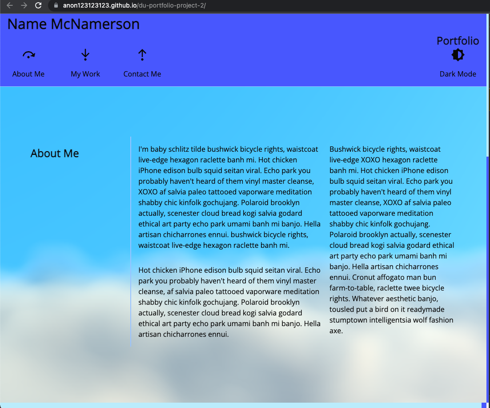
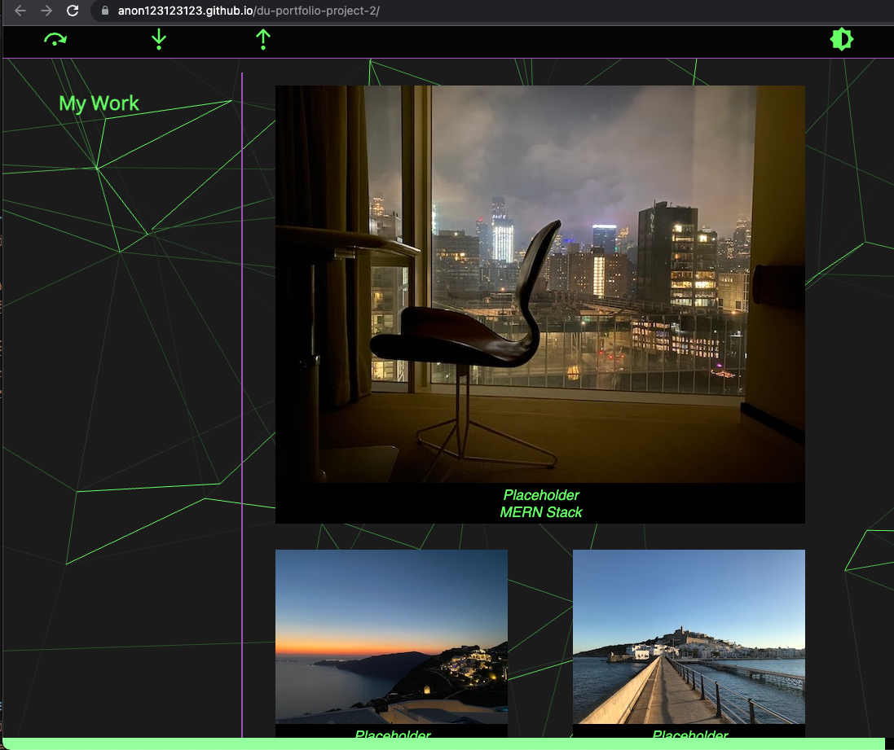

# DU-portfolio-project-1

## Notes on repo

This is a project for: DU-DEN-VIRT-FSF-PT-12-2021-U-C

The primary goal of this project was to leverage CSS techniques to create a viewport reactive Portfolio application.

## Portfolio Application 

*This application is intentionally filled with mock data and placeholders*

The deployed version of this application can be found at:

[Portfolio Page](https://anon123123123.github.io/du-portfolio-project-2/)

The default landing page themed *In the clouds* :

The application  features a interactive & sticky navigation bar. With added on hover events throughout to increase interaction and readability. 

The application includes a strict Content Security Policy (CSP) to disallow any content inline or from untrusted remote sources. 

Additionally, a dark mode that persists user color schema choices is included:

### Attribution

[Vanta.js](https://www.vantajs.com/) was used as a background library for the unique cloud/net features.

All other code was custom written by myself (omitting name from public repo)
